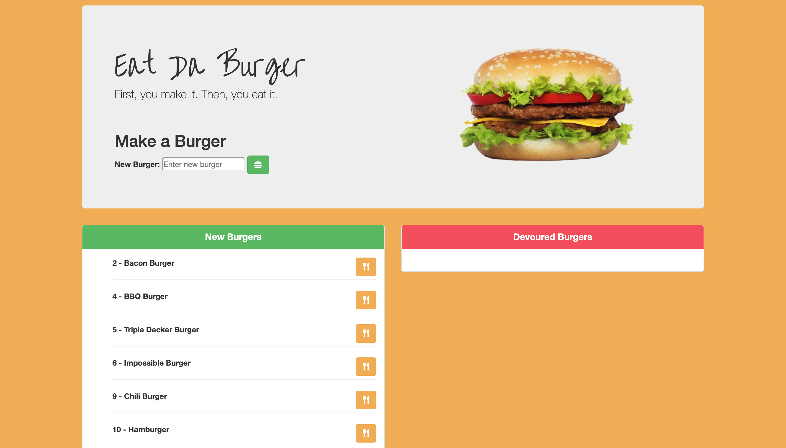

# Eat-Da-Burger

# Stack
This app was made using Node.js, Express, and the Handlebars template engine along with some Bootstrap styling, FontAwesome icons, and Google Fonts. 

# Link
https://eat-a-burger-tb.herokuapp.com/

# Minimum Requirements
Attempt to complete homework assignment as described in instructions. If unable to complete certain portions, please pseudocode these portions to describe what remains to be completed. Hosting on Heroku and adding a README.md are required for this homework. In addition, add this homework to your portfolio, more information can be found below.

# Screenshot

# User Story
AS a USER, I WANT to be ABLE to CREATE a new burger, DEVOUR one that has been CREATED, and DELETE it after that. 